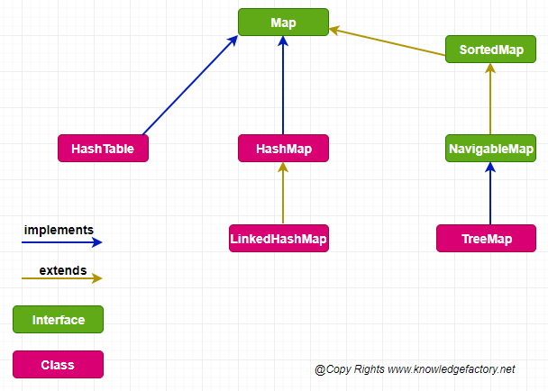

## **Collection Interface**. 
. 

HashSet uses HashMap in its implementation to store objects. Values for Set are stored as Keys in HashMap with a constant value PRESENT. 
There is also PriorityBlockingQueue. 

## **Map Interface**. 
. 
There is also ***EnumMap implements Map*** whose keys are values of an enum. 
