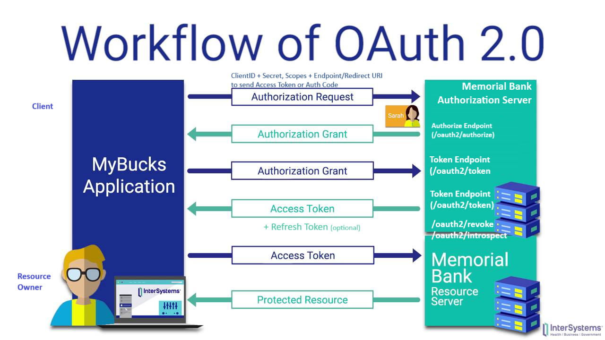

# [OAuth 2.0](https://datatracker.ietf.org/doc/html/rfc6749)
    Is an Authorization protocol and NOT an Authentication protocol

    OAuth defines 4 roles: Resource Owner, Client, Authorization Server, Resource Server
    

  
## Grant Types in OAuth 2.0

> ### Authorization Code Grant
- The Authorization server returns single use Access Code to the client which is then exchanged for Access token. Best option for **Traditional Web apps** where exchange can happen securely on server side

> ### Implicit Grant
- The authorization server may return the Access Token as a parameter in the callback URI or as a response to a form post

> ### Authorization Code Grant with PKCE (Proof of KeyCode Exchange)
- Used by **SPAs & Mobile/Native apps** as they cannot use client id which will be stored on browser/

> ### Resource Owner Credentials Grant Type
- Requires the Client first to acquire the resource owner’s credentials, which are passed to the Authorization server. So used only with **trusted clients**.

> ### Client Credentials Grant Type
- Used for non-interactive apps like **microservices, automated process** etc.
  
> ### Device Authorization Flow
- For use by apps on input-constrained devices, such as **smart TVs**.

## [Authorization Code Flow with PKCE (Proof Of KeyCode Exchange) with Authentication](https://auth0.com/docs/get-started/authentication-and-authorization-flow/authorization-code-flow-with-proof-key-for-code-exchange-pkce)

## JWT Token

