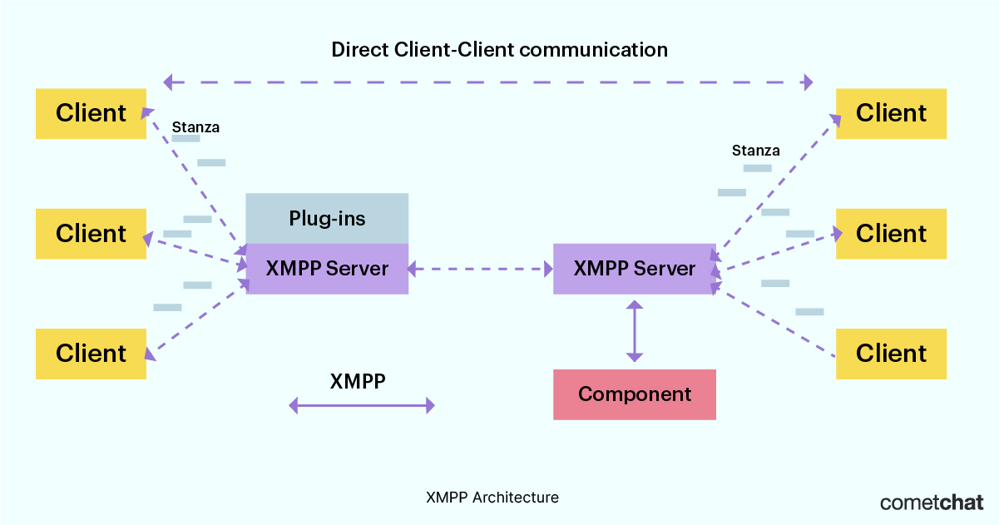

## XMPP Vs WSS. 
https://www.cometchat.com/blog/xmpp-vs-websockets-instant-messaging-protocol-comparison#:~:text=XMPP%20only%20allows%20you%20to,I%20should%20be%20using%20WebSocket.%22

Both creates persistent connection between client and server.

***XMPP*** - Extensible Messaging and Presence Protocol. 
Each client has has unique Jabber ID user@domain.com/resource. 
. 

***WSS*** - Web Socket (Secured) protocol. 
. 
