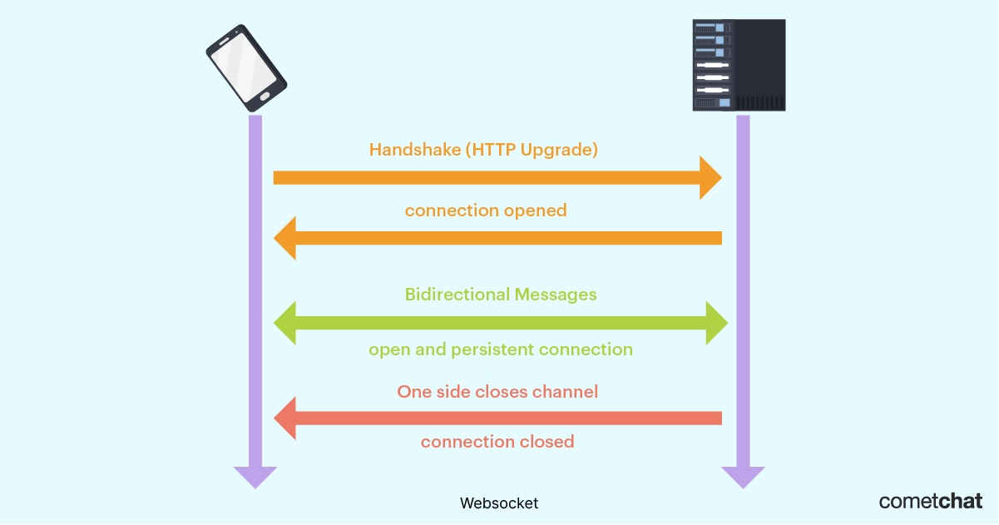

## **Storage Options** ##
**Cache**

Options: Redis, Memcache
Use: Redis (Redis is an modern version of Memcache). Redis understands data structures like list etc, so performing list append fast in Redis wrt Memcache which sees all values as a blob.

**File storage**. 
Why? To store images, videos, files etc. These are blob storages. DBMS is used when we have to query on the data. But file is something we just serve.
Options: S3

**Text search engine**. 
Why?
Netflix: search for a movie
Amazon: search for a product
Uber: search for a location
Options: Elastic Search, Solar (build over lucene)
Important: They are search engines, not databases. They give availability and redundancy but no guarantee on data, so data may be lost. Store critical data somewhere else.

**Fuzzy text search**. 
Why? User may type wrong spelling. For eg, instead of Airport, may type Ariport.
Options: Elasticsearch, Solar

**Timeseries database**. 
Why? For metrics
Options: InfluxDB, OpenTSDB 
Note: These are kind of RDBMS with some customization. In it, user will write always in append-only mode and wont edit old data. Also, queries will be bulk queries on a time range. So, optimized for that.

**Data Warehouse/ Big Data**. 
Why? Want to store huge data for analytics. Eg for Amazon, which country giving more revenue, which geography has more transactions, which product sold where most etc.
Options: Hadoop
Note: This is more for offline processing.

**RDBMS**
Why? When information is structured. And when we need ACID guarantees. For eg, in banking, amount debited but not credited, different account balance for different queries etc
Options: MySQL, PostgreSQL, Oracle

**NoSQL (Document DB)**
Why? For Amazon, building catalogue. Catalogue can have different type of items with different attributes. Eg, T-shirt, Washing machine, Refrigerator, Milk, Medicine etc. This can be stored as json in RDBMS but NoSQL DBs are designed to handle such kind of queries in a more optimized manner.
Options: MongoDB, CouchBase

**NoSQL (Columnar DB)**
Why? When data is ever increasing. Eg, Uber drivers keep sending their location data every few minutes. And if drivers keep increasing, data will keep growing exponentially. But queries will be low only on this huge data, like what locations for a given driver id.
Options: Cassandra, Hbase

## **SQL Vs NoSQL Databases**

https://www.thorntech.com/sql-vs-nosql/

| SQL Database                                                 | NoSQL Database                                               |
| ------------------------------------------------------------ | ------------------------------------------------------------ |
| Great fit for transaction oriented systems/systems with structured data | Great fot for unstructured data                              |
| Used when you need **ACID** (Atomicity, Consistency, Isolation, Durability) compliance | Built with flexibility & Scalability in mind and follows **BASE** consistency model |
| **Atomicity** - Each transaction either succeeds completely or is fully rolled back. **Consistency**: data must be valid according to all defined rules. **Isolation**: Transactions are run concurrently, they do not contend with each other.   **Durability** - Once transaction has been committed, it is considered permanent, even in the event of system failure. | **Basic Availability**: While DB gaurantees availability of data, the DB may fail to obtain the requested data. **Soft state**: The state of DB can be chaning over time. Eventual **Consistency**: The DB will eventually become consistent |
| Can scale only vertically, meaning can add RAM, storage etc. | Can scale horizontally, meaning you can add more servers     |
| Data stored in a predefined schema                           | The data can be column stores, document-oriented, graph-based, or key-value pairs |

**NoSQL Databases**

***Mongo DB Vs Cassandra/DynamoDB***
- 1 master, multiple slave **Vs** Multiple master/slave configuration - because of this reason write performance of Cassandra is better
- Write requests goes only to master, hence less scalable for write operation **Vs** Multiple master node makes writing more scalable
- Possibility of downtime (20-30 secs) when the master goes down until the slave becomes master **Vs** because of multiple master it is highly available
- Availability of Secondary Index makes querying faster **Vs** Only cursory support for secondary index
- Suuports BSON, JSON data format **Vs** JSON only
- Supports unstructured/nested data **Vs** Data still stored in rows/cols (just not relational)
- Both support Sharding/Horizontal Partitioning

## XMPP Vs WSS. 
https://www.cometchat.com/blog/xmpp-vs-websockets-instant-messaging-protocol-comparison#:~:text=XMPP%20only%20allows%20you%20to,I%20should%20be%20using%20WebSocket.%22

Both creates persistent connection between client and server.

***XMPP*** - Extensible Messaging and Presence Protocol. 
Each client has has unique Jabber ID user@domain.com/resource. 
. 

***WSS*** - Web Socket (Secured) protocol. 
. 
