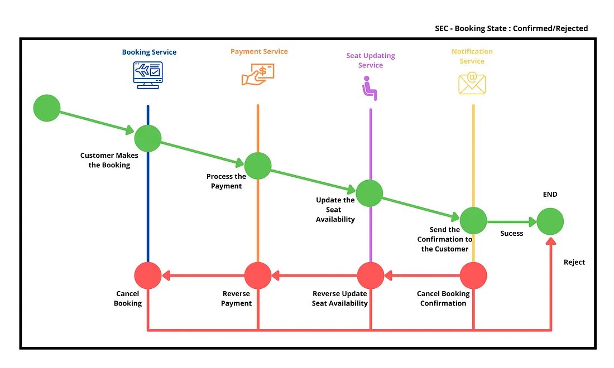
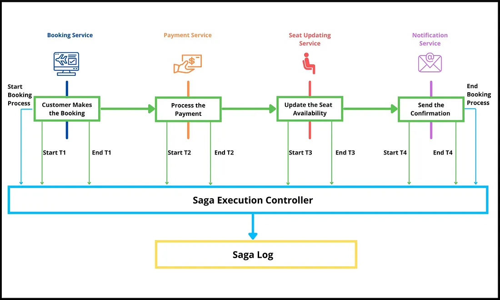

[Eventual Consistency](https://blog.bitsrc.io/eventual-consistency-in-microservices-a8106d8dd0ab)
  -  CAP Theorem (Consistency, Availability, Partition Tolerance) is used. Prioritizing Availability & Partition Tolerance
    
  -  How to acheive Eventual Consistency
      - Conflict Resolution Mechanisms
          1. Last-writer-wins (LWW)
          2. Vector clocks
              - The vector clock approach assigns a list of integers known as a vector clock for each data record replica. When an update is made to a data replica, the vector clock for that replica is incremented. Then, when a replica receives an update from another replica, it can compare the vector clocks to determine which version of the data is more recent.
      - Replication Techniques
          1. Master-Slave replication
             - A single master node is responsible for writing data, and multiple slave nodes are there to read data. Changes propogated from master to slave.
          2. Multi-Master/Master-master replication
             - All nodes are treated as master nodes. Updates can be made to any node and gradually propagated to other nodes.
          3. Active-active replication
             - Multiple nodes are actively serving requests, either reading or writing. All the nodes are capable of reading and writing data. Updates can be made to any node and gradually propagated to other nodes
               
-  Handling Transactions in Eventual Consistency
    - [SAGA pattern](https://blog.bitsrc.io/how-to-use-saga-pattern-in-microservices-9eaadde79748)
      
        Break long transactions into a series of local transactions. A central component SAGA Execution Controller(SEC) controls the local transactions and rollback events.

        1. Orchestration Based SAGA
            - A single Orchestrator acts as a centralized controller of all these local transactions and maintains the status of individual & complete transaction. It can rollback on failure at a certain point or commit at the end and send confirmation.
              . 
        2. Coreography Based Saga
            - Each Microservice is responsible for generating a new event. And it will trigger the transaction of the next Microservice. Saga execution controller keeps track of all these events using the SEC log and executes rollback events in case of a failure.
              . 
